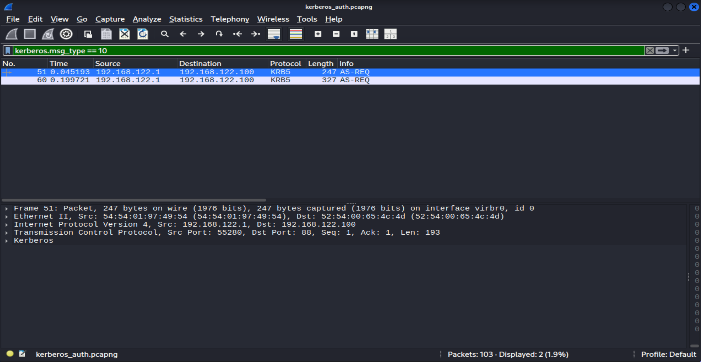
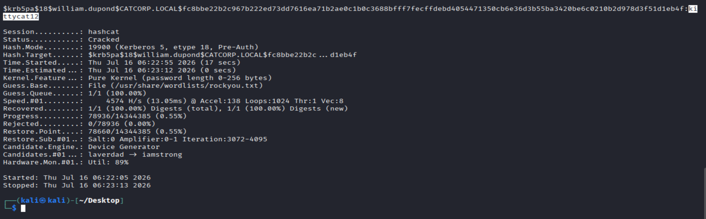

# Investigating a Suspicious Kerberos Pre-Authentication

## Scenario

Cat Corporation's Security Operations Center (SOC) requested an investigation into a suspicious Kerberos authentication observed in a provided PCAP file.

The objective is to analyze the captured Kerberos traffic, identify the user associated with the authentication request, extract the pre-authentication data, and determine whether the user's password can be recovered.

---

# Tools Used

* Wireshark
* Hashcat

---

# Step 1 – Inspecting the PCAP

The provided PCAP file was opened in **Wireshark**.

To focus on Kerberos Authentication Service Requests (AS-REQ), I applied the following display filter:

```text
kerberos.msg_type == 10
```

This filter displays Kerberos **AS-REQ** messages, which are sent by a client when requesting a Ticket Granting Ticket (TGT).



---

# Step 2 – Inspecting the Kerberos AS-REQ

The filtered traffic revealed a Kerberos **Authentication Service Request (AS-REQ)**.

By inspecting the packet, I identified the following information:

* Username: `william.dupond`
* Realm: `CATCORP.LOCAL`
* Encryption Type: `AES256-CTS-HMAC-SHA1-96 (etype 18)`

The packet also contained the **PA-ENC-TIMESTAMP** field, which includes the encrypted pre-authentication data required for offline password recovery.


---

# Step 3 – Extracting the Pre-Authentication Data

The **PA-ENC-TIMESTAMP** field contains the encrypted timestamp generated by the client during Kerberos pre-authentication.

To prepare the captured authentication data for password recovery, I extracted the following values:

* Username
* Realm
* Encryption Type
* Ciphertext

These values were required to construct a Hashcat-compatible Kerberos hash.


---

# Step 4 – Building the Hash

Hashcat expects Kerberos AS-REQ hashes (etype 18) in the following format:

```text
$krb5pa$18$USERNAME$REALM$CIPHERTEXT
```

Using the extracted values, the hash was formatted as follows:

```text
$krb5pa$18$william.dupond$CATCORP.LOCAL$fc8bbe22b2c967b222ed73dd7616ea71b2ae0c1b0c3688bfff7fecffdebd4054471350cb6e36d3b55ba3420be6c0210b2d978d3f51d1eb4f
```

---

# Step 5 – Recovering the Password

The extracted Kerberos hash was validated using **Hashcat** with **Mode 19900** and the **rockyou.txt** wordlist.

```bash
hashcat -m 19900 hash.txt /usr/share/wordlists/rockyou.txt
```



Recovered credentials:

| Field    | Value            |
| -------- | ---------------- |
| Username | `william.dupond` |
| Realm    | `CATCORP.LOCAL`  |
| Password | `kittycat12`     |

The recovered password confirms that the captured Kerberos pre-authentication data was vulnerable to offline password recovery due to weak password complexity.

---

# Result

The investigation successfully identified the Kerberos AS-REQ associated with the captured authentication.

The extracted pre-authentication data was converted into a Hashcat-compatible format, allowing the user's password to be recovered.

Recovered credentials:

```text
william.dupond
Password: kittycat12
```

This demonstrates how weak passwords can be recovered from captured Kerberos pre-authentication data, even when strong encryption algorithms such as AES-256 are used.

---

# What I Learned

* Analyzing Kerberos authentication traffic in Wireshark.
* Identifying Kerberos AS-REQ messages.
* Understanding the Kerberos pre-authentication process.
* Extracting the PA-ENC-TIMESTAMP and ciphertext.
* Formatting Kerberos hashes for Hashcat.
* Validating password strength through offline password recovery.
* Documenting the investigation in a clear and structured format.
