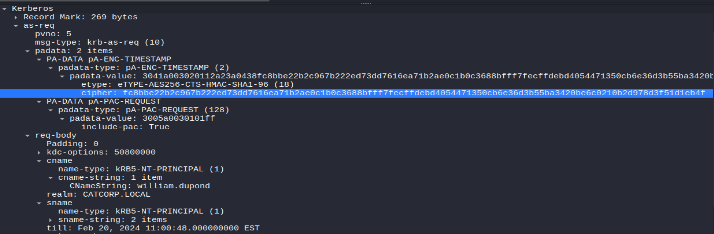

# SOC Case Study: Kerberos Pre-Authentication Analysis (PCAP Investigation)

> This repository documents the analysis of a Kerberos authentication exchange extracted from a PCAP file as part of a cybersecurity training lab. The objective was to investigate the Kerberos authentication process, identify exposed pre-authentication data, and assess the associated security risks.

---

# Skills Demonstrated

* Network Traffic Analysis
* Wireshark Packet Inspection
* Kerberos Authentication Analysis
* PCAP Investigation
* Hash Extraction
* Password Security Assessment
* Security Reporting

---

# 1. Executive Summary

During the analysis of the provided PCAP file, a Kerberos Authentication Service Request (AS-REQ) was identified for the Active Directory user **william.dupond**.

The captured authentication exchange contained Kerberos pre-authentication data (`PA-ENC-TIMESTAMP`). To evaluate the security impact of this data, the extracted authentication hash was validated using Hashcat.

The validation successfully recovered the account password in approximately **17 seconds**, demonstrating how weak passwords can expose Kerberos-authenticated accounts to offline password recovery attacks.

This case study highlights the importance of strong password policies even when secure authentication protocols such as Kerberos are used.

---

# 2. Lab Information

| Item                   | Value                                                               |
| ---------------------- | ------------------------------------------------------------------- |
| Lab Type               | PCAP Analysis                                                       |
| Protocol               | Kerberos v5                                                         |
| Authentication Message | AS-REQ                                                              |
| Target User            | william.dupond                                                      |
| Domain                 | CATCORP.LOCAL                                                       |
| User Principal Name    | [william.dupond@catcorp.local](mailto:william.dupond@catcorp.local) |
| Encryption Type        | AES256-CTS-HMAC-SHA1-96 (etype 18)                                  |
| Analysis Tools         | Wireshark, Hashcat                                                  |

---

# 3. Objectives

The objectives of this case study were to:

* Analyze Kerberos authentication traffic.
* Identify Kerberos AS-REQ messages.
* Extract Kerberos pre-authentication data.
* Assess the security risk associated with the captured authentication exchange.
* Document the findings using a SOC-style investigation report.

---

# 4. Investigation Walkthrough

## Phase 1 – Traffic Analysis (Wireshark)

The PCAP file was inspected using Wireshark.

To isolate Kerberos Authentication Service Requests, the following display filter was applied:

```text
kerberos.msg_type == 10
```

The analysis identified an AS-REQ generated by the user:

* Username: `william.dupond`
* Realm: `CATCORP.LOCAL`

The Kerberos Pre-Authentication (`PA-ENC-TIMESTAMP`) field contained encrypted authentication data that was extracted for further analysis.



---

## Phase 2 – Hash Extraction

The extracted authentication data was formatted into the standard Hashcat format for Kerberos 5 AS-REQ (etype 18).

```text
$krb5pa$18$william.dupond$CATCORP.LOCAL$fc8bbe22b2c967b222ed73dd7616ea71b2ae0c1b0c3688bfff7fecffdebd4054471350cb6e36d3b55ba3420be6c0210b2d978d3f51d1eb4f
```

---

## Phase 3 – Password Strength Validation

To assess the security impact of the captured authentication data, Hashcat was used to determine whether the password could be recovered through an offline dictionary attack.

**Command Used**

```bash
hashcat -m 19900 hash.txt /usr/share/wordlists/rockyou.txt
```

### Result

The password was successfully recovered after approximately **17 seconds**, consuming only **0.55%** of the wordlist.

Recovered password:

```text
kittycat12
```

This result demonstrates that weak passwords remain vulnerable to offline password recovery attacks even when Kerberos uses strong encryption.


---

# 5. Findings

The analysis identified the following:

* A valid Kerberos AS-REQ authentication exchange was present.
* Kerberos pre-authentication data was successfully extracted.
* The extracted data was compatible with offline password recovery tools.
* The account password was successfully recovered due to insufficient password complexity.

---

# 6. Security Impact

If an attacker captured the same Kerberos authentication exchange in a real environment, they could potentially:

* Perform offline password guessing.
* Recover weak user passwords.
* Authenticate using valid credentials.
* Access resources according to the compromised user's permissions.

Although Kerberos encryption remained secure, weak passwords significantly reduced the overall security of the authentication process.

---

# 7. Recommendations

To reduce the risk of similar attacks in production environments:

* Enforce strong password policies.
* Require passwords of at least 14 characters.
* Prevent dictionary-based passwords.
* Enable Multi-Factor Authentication (MFA).
* Monitor Windows Event IDs **4768** and **4771**.
* Periodically audit password strength.
* Train users on secure password creation.

---

# 8. Lessons Learned

This case study demonstrates that secure authentication protocols alone cannot fully protect user accounts when weak passwords are used.

Through this lab, I practiced:

* Analyzing Kerberos authentication traffic.
* Investigating PCAP files using Wireshark.
* Understanding Kerberos pre-authentication.
* Extracting authentication data.
* Assessing password strength using Hashcat.
* Documenting technical findings in a SOC reporting format.

---

# 9. References

* Wireshark
* Hashcat
* Kerberos Authentication Protocol
* MITRE ATT&CK (Credential Access)

---

# Conclusion

This lab provided practical experience in analyzing Kerberos authentication traffic and assessing the security implications of exposed pre-authentication data.

Although performed in a controlled training environment, the techniques demonstrated in this case study reflect real-world analysis tasks commonly performed by SOC analysts when investigating authentication-related security events.
