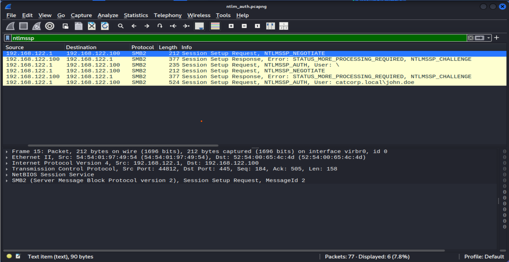
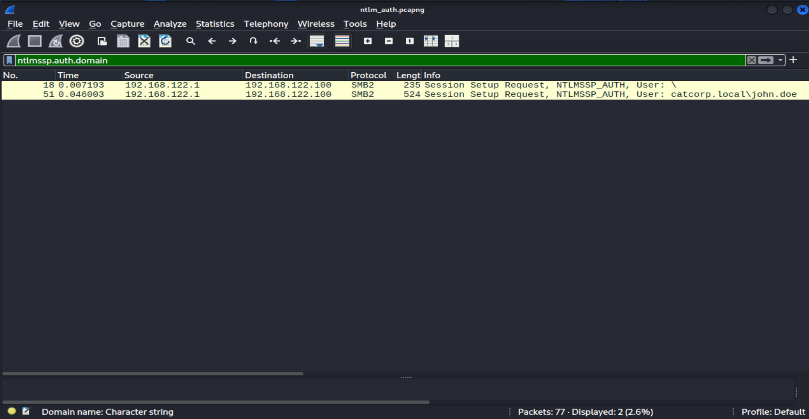
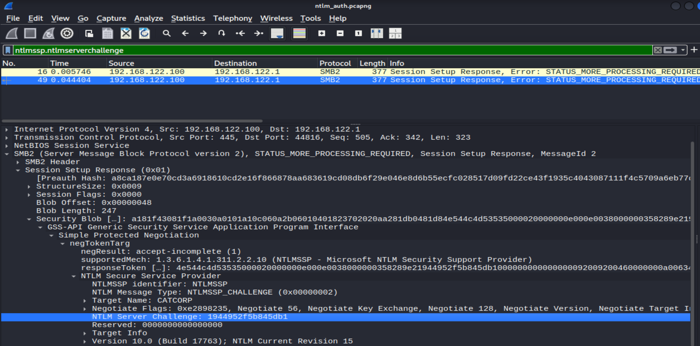
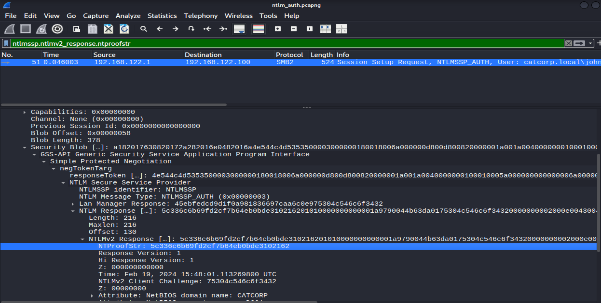
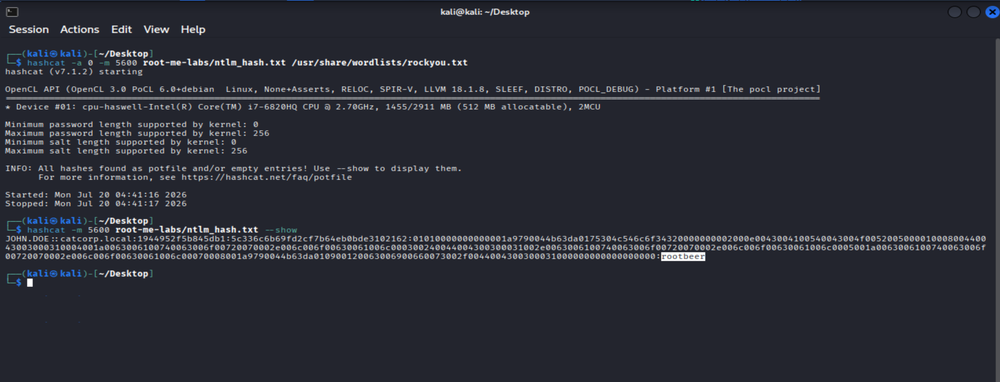

# Investigating a Suspicious NTLM Authentication over SMB

## Scenario

Cat Corporation's Security Operations Center (SOC) requested an investigation into a suspicious NTLM authentication observed over an SMB connection.

The objective is to analyze the provided PCAP file, identify the captured NTLM authentication, extract the challenge-response, and determine whether the associated password can be recovered.

---

# Tools Used

* Wireshark
* Hashcat

---

# Step 1 – Inspecting the PCAP

The provided PCAP file was opened in **Wireshark**.

To simplify the analysis, I filtered the capture to display only NTLM traffic.

**Wireshark Filter**

```text
ntlmssp
```



---

# Step 2 – Identifying the NTLM Handshake

The filtered traffic revealed a complete NTLM authentication exchange over SMB.

NTLM authentication consists of three messages:

1. **Negotiate (Type 1)** – Sent by the client to initiate NTLM authentication.
2. **Challenge (Type 2)** – Sent by the server and contains an 8-byte random challenge.
3. **Authenticate (Type 3)** – Sent by the client and contains the NTLM authentication data.

The **Authenticate (Type 3)** message is the most important because it contains the information required to construct the NTLMv2 challenge-response.


---

# Step 3 – Inspecting the Authenticate Message

Next, I inspected the **NTLM Authenticate (Type 3)** message.

The packet contains several useful fields, including:

* Username
* Domain
* NTProofStr
* NTLM Response

These values are required to build the NTLMv2 hash for offline password recovery.



---

# Step 4 – Extracting the Required Values

The required values were collected from the NTLM authentication exchange.

### Server Challenge

The **Server Challenge** was extracted from the **Challenge (Type 2)** message.



---

### NTProofStr and NTLM Response

The **NTProofStr** and **NTLM Response** were extracted from the **Authenticate (Type 3)** message.

The NTProofStr is the first 16 bytes of the NTLMv2 response, while the remaining bytes form the NTLM response blob.



---

# Step 5 – Building the Hash

Hashcat expects the NTLMv2 challenge-response in the following format:

```text
USERNAME::DOMAIN:SERVER_CHALLENGE:NT_PROOF:NTLM_RESPONSE
```

Using the extracted values, the hash was constructed as follows:

```text
JOHN.DOE::catcorp.local:1944952f5b845db1:5c336c6b69fd2cf7b64eb0bde3102162:01010000000000001a9790044b63da0175304c546c6f34320000000002000e0043004100540043004f005200500001000800440043003000310004001a0063006100740063006f00720070002e006c006f00630061006c000300240044004300300031002e0063006100740063006f00720070002e006c006f00630061006c0005001a0063006100740063006f00720070002e006c006f00630061006c00070008001a9790044b63da010900120063006900660073002f0044004300300031000000000000000000
```

---

# Step 6 – Recovering the Password

The extracted hash was validated using **Hashcat** with **Mode 5600** (NTLMv2).

```bash
hashcat -a 0 -m 5600 ntlm_hash.txt /usr/share/wordlists/rockyou.txt
```

After the initial recovery, Hashcat stored the result in its local **potfile**.

To display the recovered credentials again, I used:

```bash
hashcat -m 5600 ntlm_hash.txt --show
```



Recovered credentials:

| Field    | Value           |
| -------- | --------------- |
| Username | `JOHN.DOE`      |
| Domain   | `catcorp.local` |
| Password | `rootbeer`      |

---

# Result

The investigation confirmed that the captured NTLM challenge-response could be used for offline password recovery.

The recovered credentials were:

```text
JOHN.DOE
Password: rootbeer
```

This demonstrates how weak passwords can be recovered when NTLM authentication traffic is captured.

---

# What I Learned

* Analyzing NTLM authentication in Wireshark.
* Understanding the NTLM negotiation, challenge, and authenticate messages.
* Extracting the Server Challenge, NTProofStr, and NTLM Response.
* Formatting an NTLMv2 hash for Hashcat.
* Performing offline password recovery validation.
* Documenting the investigation in a clear and structured format.
