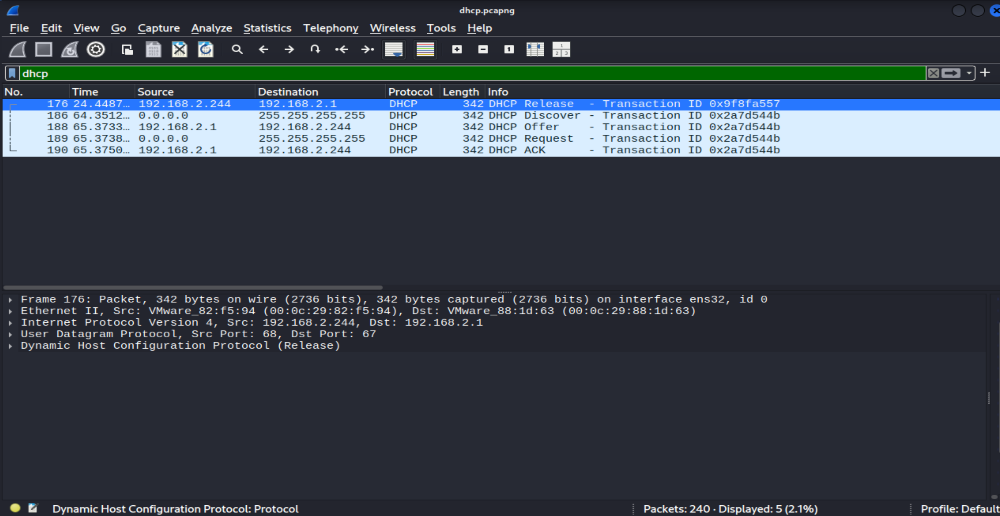
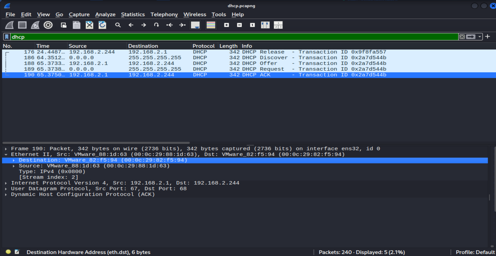
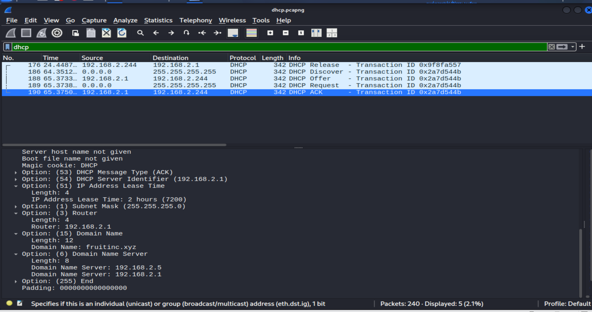

# DHCP Traffic Analysis

## Objective

Analyze the provided DHCP traffic to understand the IP address assignment process and identify the network configuration delivered to the client.

---

# Tools Used

* Wireshark

---

# Step 1 – Inspecting the PCAP

The provided PCAP file was opened in **Wireshark**.

To focus on DHCP traffic, I applied the following display filter:

```text
dhcp
```

The capture contained **five DHCP packets**.



---

# Step 2 – Analyzing the DHCP Exchange

The first packet was a **DHCP Release** message, indicating that the client released its previously assigned IP address.

From the packet timestamps, the client released its IP address at approximately **24 seconds**.

Later, at approximately **64 seconds**, the client requested a new IP address by initiating a standard DHCP handshake.

The remaining four packets followed the normal DHCP process:

1. **DHCP Discover** – The client searched for an available DHCP server.
2. **DHCP Offer** – The server offered an IP address and network configuration.
3. **DHCP Request** – The client requested the offered IP address.
4. **DHCP ACK** – The server confirmed the lease and delivered the final network configuration.


---

# Step 3 – Examining the DHCP ACK Packet

The DHCP ACK packet contains the configuration assigned to the client.

During the analysis, the following information was identified:

| Field | Value |
|------|-------|
| Client IP Address | `192.168.2.244` |
| DHCP Server IP Address | `192.168.2.244` |
| DNS Server | `192.168.2.1 and 192.168.2.5` |
| Default Gateway | `192.186.2.1` |
| Subnet Mask | `255.255.255.0` |
| DHCP Server Identifier | `192.186.2.1` |
| Lease Time | `2 Hours` |
| Domain Name | `fruitinc.xyz` |
| Client MAC Address | `00:0c:29:82:f5:94` |
| Server MAC Address | `00:0c:29:88:1d:63` |
| Transaction ID | '0x2a7d544b' |





---

# Findings

The analysis shows that the client first released its existing IP address before requesting a new lease from the DHCP server.

The DHCP server successfully completed the DHCP handshake and assigned the client a new network configuration, including the IP address, DNS server, default gateway, subnet mask, lease duration, and domain information.

---

# What I Learned

* Identifying DHCP traffic in Wireshark.
* Understanding the DHCP Release process.
* Analyzing the DHCP Discover, Offer, Request, and ACK messages.
* Extracting network configuration from DHCP Options.
* Interpreting client and server information during DHCP communication.
