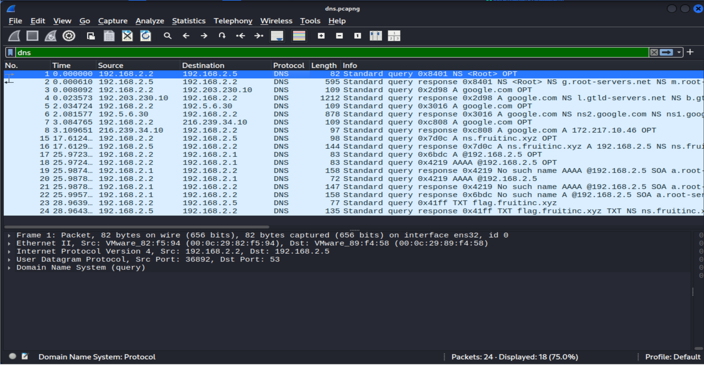
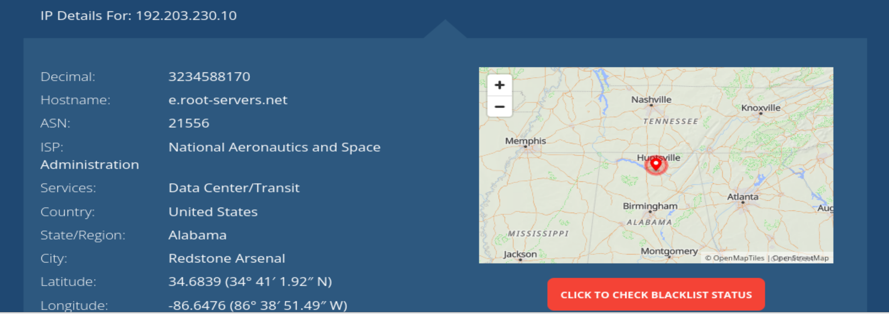
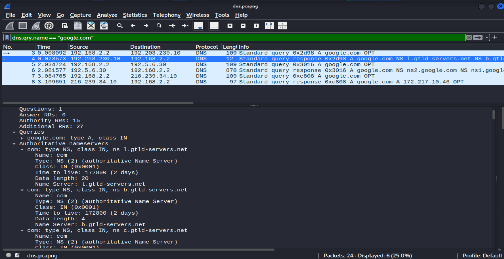
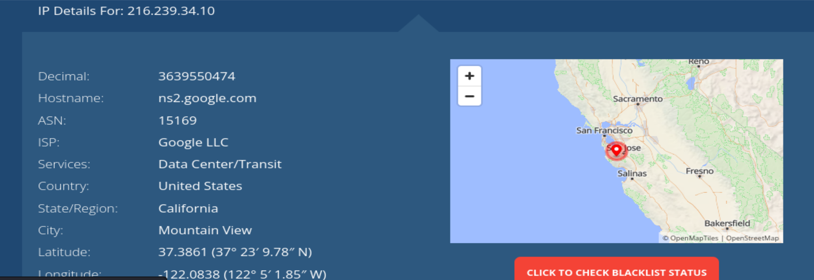
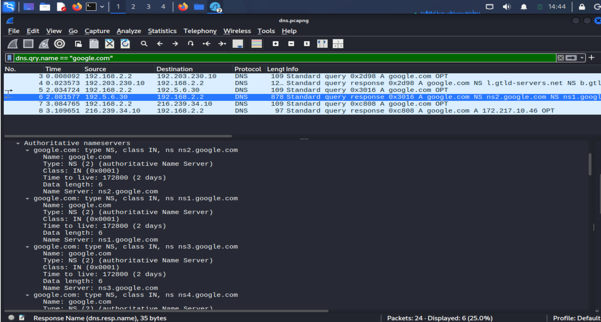
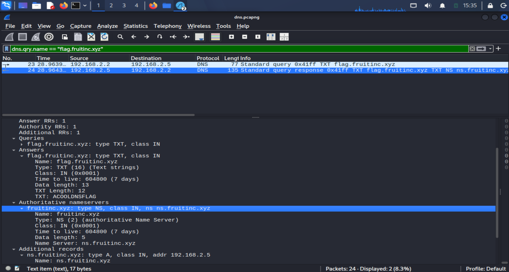

# DNS Traffic Analysis

## Objective

The goal of this analysis was to examine the DNS traffic captured in `dns.pcapng`, follow the DNS resolution process, and investigate the DNS records related to `fruitinc.xyz`.

## Tools Used

- **Wireshark**
- **PCAP:** `dns.pcapng`

---

## Step 1 – Inspecting the DNS Traffic

I started by filtering the traffic using:

```text
dns
```

The capture contained **24 packets** in total, with **18 DNS packets** displayed.

The DNS traffic consisted of:

- 9 DNS queries
- 9 DNS responses

The packets showed several DNS resolution activities, including requests for `google.com` and `fruitinc.xyz`.



The main Wireshark view showed:

```text
Filter: dns

Packets: 24
Displayed: 18
```

---

## Step 2 – Following the DNS Resolution of `google.com`

To understand how DNS resolution was performed, I followed the DNS requests for `google.com` using:

```text
dns.qry.name == "google.com"
```

The first query was sent from:

```text
192.168.2.2
```

to:

```text
192.203.230.10
```

At this point, I wanted to verify which DNS server was associated with the destination IP rather than relying only on the information shown in Wireshark.

I performed an IP lookup for `192.203.230.10`, which identified the address as:

```text
e.root-servers.net
```

This matched the DNS resolution behavior observed in the PCAP and confirmed that the request was sent to a **Root DNS server**.



The Root DNS server did not provide the final IP address of `google.com`. Instead, it returned a referral to the `.com` TLD name servers.

The response included servers such as:

```text
l.gtld-servers.net
b.gtld-servers.net
```



The screenshot shows:

```text
Packet 3:
192.168.2.2 → 192.203.230.10
A query for google.com

Packet 4:
192.203.230.10 → 192.168.2.2
Response containing a referral to the .com TLD name servers
```

---

## Step 3 – Querying the `.com` TLD Server

After receiving the referral from the Root DNS server, the resolver continued the lookup through the `.com` TLD infrastructure.

The next query for `google.com` was sent to:

```text
192.5.6.30
```

which corresponds to:

```text
a.gtld-servers.net
```

The response provided information about Google's authoritative name servers, including:

```text
ns1.google.com
ns2.google.com
ns3.google.com
```

This allowed the resolver to identify the authoritative DNS infrastructure for `google.com`.

---

## Step 4 – Following the DNS Resolution to the Authoritative DNS Server

After receiving the referral from the `.com` TLD server, the resolver sent another A query for `google.com` to:

```text
216.239.34.10
```

I then verified the destination IP using an IP lookup. The address was identified as:

```text
ns2.google.com
```

This confirmed that the resolver had reached one of Google's authoritative DNS servers.



The response then returned the final IPv4 address for `google.com`:

```text
google.com → 172.217.10.46
```

Based on the packets observed in Wireshark, the complete DNS resolution path was:

```text
192.168.2.2
      │
      │ A google.com
      ▼
e.root-servers.net
192.203.230.10
      │
      │ Referral
      ▼
a.gtld-servers.net
192.5.6.30
      │
      │ Referral
      ▼
ns2.google.com
216.239.34.10
      │
      │ A google.com
      ▼
172.217.10.46
```



The screenshot shows **Packets 3–8** together, demonstrating the complete resolution process:

**Root DNS → `.com` TLD → Google's authoritative DNS server → Final IPv4 address**

---

## Step 5 – Investigating `fruitinc.xyz`

I then filtered the traffic related to `fruitinc.xyz` using:

```text
dns.qry.name contains "fruitinc.xyz"
```

The capture showed a request for:

```text
ns.fruitinc.xyz
```

The query was:

```text
192.168.2.2 → 192.168.2.5
```

for an A record:

```text
ns.fruitinc.xyz
```

The response returned:

```text
ns.fruitinc.xyz → 192.168.2.5
```

More importantly, the response identified:

```text
fruitinc.xyz
    NS
    ns.fruitinc.xyz
```

under **Authoritative nameservers**.

This confirms that `ns.fruitinc.xyz` is the authoritative name server for `fruitinc.xyz`.



The relevant DNS sections showed:

```text
Answers
    ns.fruitinc.xyz → 192.168.2.5

Authoritative nameservers
    fruitinc.xyz
        NS
        ns.fruitinc.xyz
```

---

## Step 6 – Investigating the TXT Record

After identifying the authoritative name server, the capture showed a query for:

```text
flag.fruitinc.xyz
```

The query type was:

```text
TXT
```

I used the following filters to investigate the record:

```text
dns.qry.name == "flag.fruitinc.xyz"
```

or:

```text
dns.qry.type == 16
```

The response contained the following TXT value:

```text
ACOOLDNSFLAG
```

The observed DNS record was:

| Domain | Type | Value |
|---|---|---|
| `flag.fruitinc.xyz` | TXT | `ACOOLDNSFLAG` |


The relevant response section showed:

```text
Domain Name System (response)
    Answers

flag.fruitinc.xyz
    TXT
    ACOOLDNSFLAG
```

---

## Findings

The DNS traffic showed multiple stages of DNS resolution.

For `google.com`, the observed resolution followed:

```text
Root DNS
   ↓
.com TLD
   ↓
Google authoritative DNS
   ↓
172.217.10.46
```

The resolution process observed in the PCAP was:

```text
192.168.2.2
   ↓
e.root-servers.net
192.203.230.10
   ↓
a.gtld-servers.net
192.5.6.30
   ↓
ns2.google.com
216.239.34.10
   ↓
google.com
172.217.10.46
```

For `fruitinc.xyz`, the capture showed:

```text
fruitinc.xyz
      ↓
ns.fruitinc.xyz
      ↓
192.168.2.5
      ↓
flag.fruitinc.xyz
      ↓
TXT
      ↓
ACOOLDNSFLAG
```

The main finding from the `fruitinc.xyz` investigation was:

```text
flag.fruitinc.xyz → TXT → ACOOLDNSFLAG
```

---

## What I Learned

- How to filter DNS traffic using Wireshark.
- How DNS queries and responses are related.
- How Root DNS servers provide referrals to TLD servers.
- How `.com` TLD servers point to authoritative DNS servers.
- How authoritative DNS servers provide the requested DNS records.
- How to identify **NS, A, AAAA, and TXT** records.
- How to verify an IP address and correlate the result with the traffic observed in a PCAP.
- How DNS TXT records can contain useful information during network investigations.
- Why unusual TXT queries should be investigated in context, especially when associated with suspicious domains or abnormal DNS behavior.
- How to follow a complete DNS resolution process directly from a PCAP.
